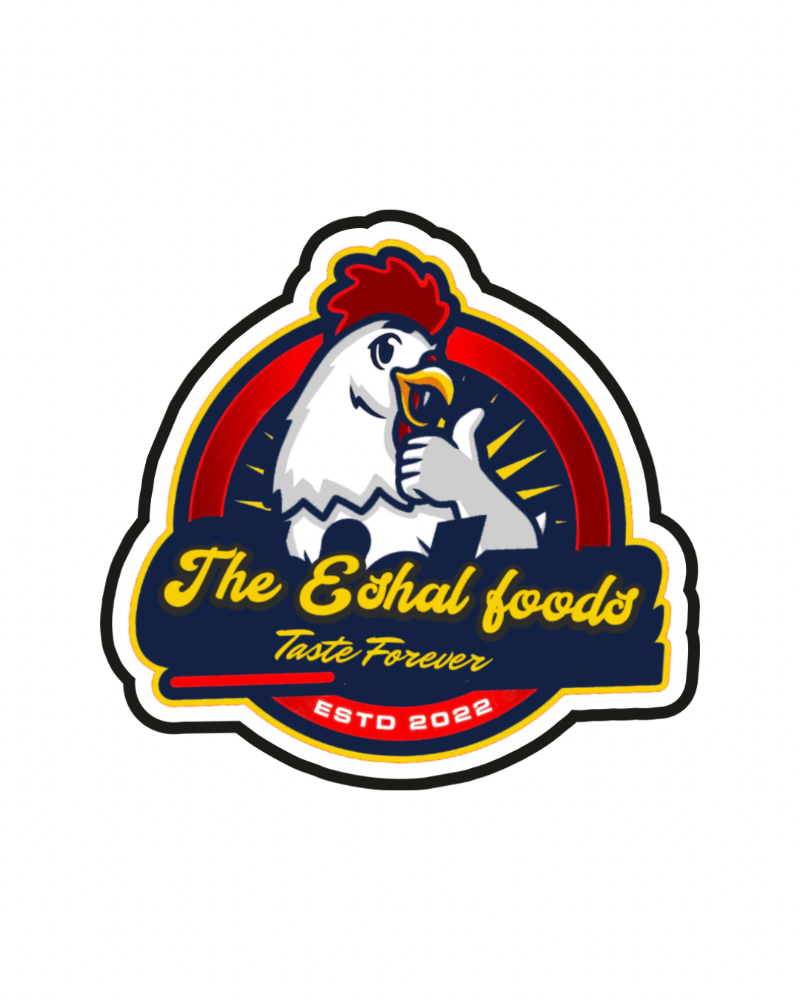

<!DOCTYPE html>  
<html lang="en">  
<head>  
    <meta charset="UTF-8">  
    <meta name="viewport" content="width=device-width, initial-scale=1.0">  
    <title>The Eshal Foods | Premium Quality & Hygienic Food Products</title>  
    <link rel="stylesheet" href="style.css">  
    <link href="https://fonts.googleapis.com/css2?family=Montserrat:wght@400;600;700&display=swap" rel="stylesheet">  
</head>  
<body>  
  
    <header class="main-header">  
        
  
              
            <nav class="main-nav">  
                <ul>  
                    <li><a href="index.html" class="active">Home</a></li>  
                    <li><a href="categories.html">Categories</a></li>  
                    <li><a href="quality.html">Quality Assurance</a></li>  
                    <li><a href="#order" class="btn-red">Order Now</a></li>  
                </ul>  
            </nav>  
        
  
    </header>  
  
    <section class="hero">  
        

  
        
  
            <h1>Premium Quality.  Hygienically Packed.</h1>  
            
Your trusted source for Chicken, Mutton, Eggs, Fish, Exotic Veggies, Fruits and more. Taste Forever (ESTD 2022)
  
            
  
                <a href="#categories" class="btn-yellow">Shop Essential Meat</a>  
                <a href="categories.html#veg" class="btn-blue-outline">Shop Exotic Veggies</a>  
            
  
        
  
    </section>  
  
    <section class="promise section-padding">  
        
  
            <h2 class="section-title">The Eshal Difference</h2>  
            
We provide the highest hygienic standard for your essentials.
  
            
  
                
  
                      
                    <h3>Vacuum Sealed Freshness</h3>  
                    
Every product is hygienically packed to preserve taste and quality.
  
                
  
                
  
                      
                    <h3>Guaranteed Sourcing</h3>  
                    
Sourced daily from selected farms and premium vendors.
  
                
  
                
  
                      
                    <h3>Swift Home Delivery</h3>  
                    
Safe, temperature-controlled delivery direct to your kitchen.
  
                
  
            
  
        
  
    </section>  
  
    <section id="categories" class="categories section-padding alternate-bg">  
        
  
            <h2 class="section-title">Explore Our Essential Categories</h2>  
            
  
                
  
                      
                    
  
                        <h3>Premium Poultry</h3>  
                        
Chicken (Cuts, Mince, Whole)
  
                        <a href="categories.html#poultry" class="btn-blue">View Chicken</a>  
                    
  
                
  
                
  
                      
                    
  
                        <h3>Exotic Vegetables</h3>  
                        
Bell Peppers, Broccoli, Avocados
  
                        <a href="categories.html#veg" class="btn-blue">View Veggies</a>  
                    
  
                
  
                
  
                      
                    
  
                        <h3>Premium Mutton</h3>  
                        
Steaks, Chops, Mince
  
                        <a href="categories.html#mutton" class="btn-blue">View Mutton</a>  
                    
  
                
  
                
  
                      
                    
  
                        <h3>Seasonal Fruits</h3>  
                        
Oranges, Berries, Grapes
  
                        <a href="categories.html#fruits" class="btn-blue">View Fruits</a>  
                    
  
                
  
                 
  
                      
                    
  
                        <h3>Fresh Seafood</h3>  
                        
Premium Fish Cuts & Shellfish
  
                        <a href="categories.html#seafood" class="btn-blue">View Seafood</a>  
                    
  
                
  
                 
  
                      
                    
  
                        <h3>Farm Eggs</h3>  
                        
Organic & Premium Eggs
  
                        <a href="categories.html#eggs" class="btn-blue">View Eggs</a>  
                    
  
                
  
            
  
        
  
    </section>  
  
    <section id="order" class="cta section-padding">  
        
  
            <h2>Ready to Experience Premium Freshness?</h2>  
            
Order direct via WhatsApp or call our team for delivery times and pricing.
  
            
  
                <a href="https://wa.me/YOUR_NUMBER" class="btn-green-lg">Order via WhatsApp</a>  
                <a href="tel:YOUR_NUMBER" class="btn-yellow-lg">Call to Order: YOUR_NUMBER</a>  
            
  
        
  
    </section>  
  
    <footer class="main-footer">  
        
  
            
  
                  
                
Taste Forever. ESTD 2022.
  
                
Providing premium quality, hygienically packed essential food products.
  
            
  
            
  
                <h3>Contact</h3>  
                
Delivery Area: YOUR_CITY_NAME
  
                
Email: info@theeshalfoods.com
  
                
Phone: YOUR_NUMBER
  
            
  
            
  
                <h3>Follow Us</h3>  
                <a href="#">Instagram</a>  
                <a href="#">Facebook</a>  
            
  
        
  
        
  
            
  
                
&copy; 2023 The Eshal Foods. All rights reserved.
  
            
  
        
  
    </footer>  
  
</body>  
</html>  
